# Сад Тишины

Сайт премиального чайного дома с каталогом, корзиной, формами заявок и отдельной панелью управления. Интерфейс полностью на русском языке и адаптирован для компьютеров, планшетов и телефонов.

## Возможности

- Каталог с поиском, сортировкой, фильтрами и диапазоном цен;
- Карточки товаров, корзина и оформление заказа;
- Страницы коллекции, бренда, партнёрских программ и журнала;
- Формы обратной связи с сохранением заявок и отправкой почты;
- Административная панель для товаров, заказов, публикаций и контента;
- Загрузка изображений, экспорт данных и управление доступом;
- Адаптивная вёрстка и плавные интерфейсные анимации.

## Основные страницы

### Главная

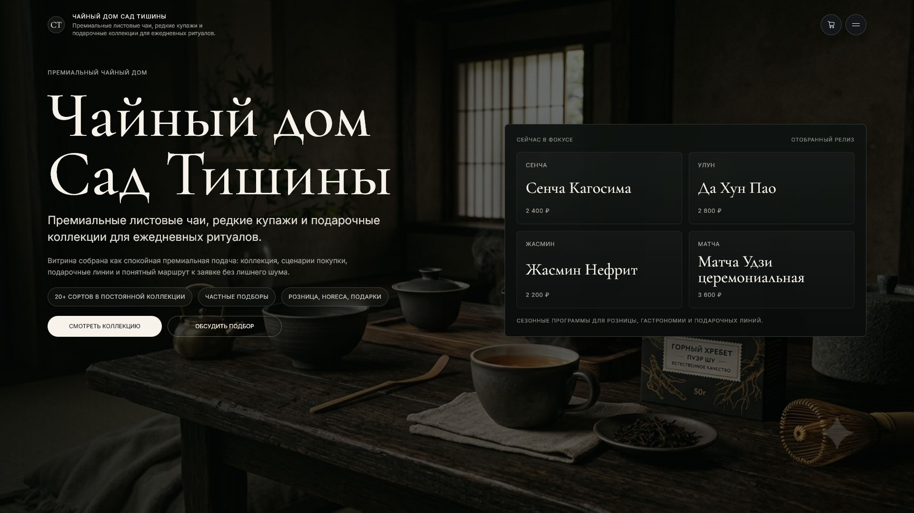

- Маршрут: `/`;
- Презентация чайного дома, актуальной коллекции и основных направлений.

### Чайная коллекция

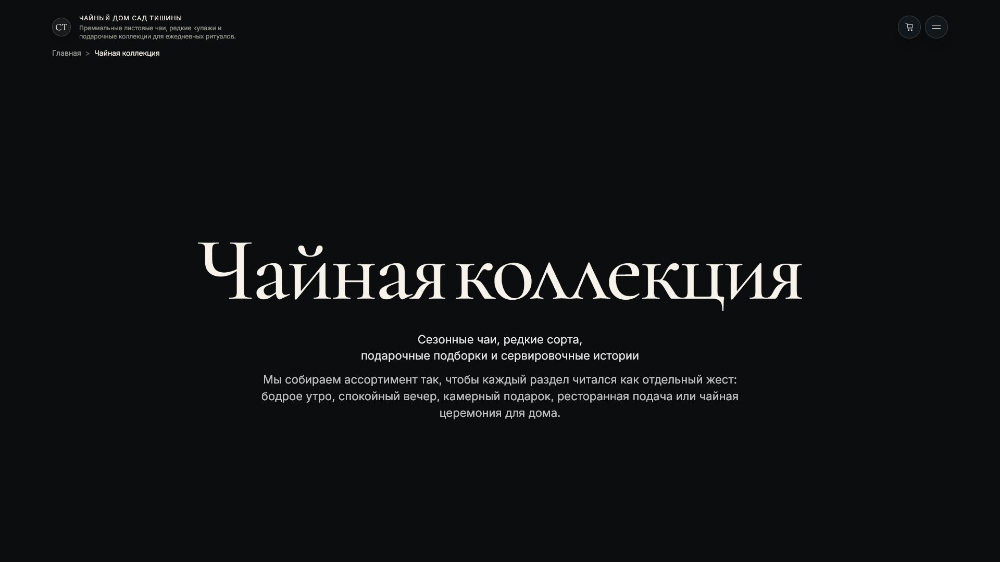

- Маршрут: `/tea`;
- Обзор ассортимента, принципов отбора и сценариев подачи чая.

### Страница товара

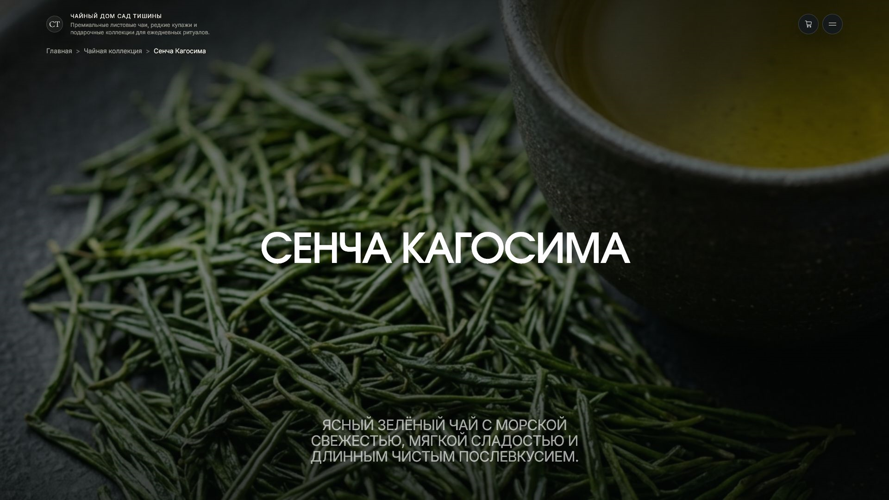

- Маршрут: `/tea/sencha`;
- Описание сенчи, характеристики, рекомендации по завариванию и добавление в корзину.

### Разделы каталога

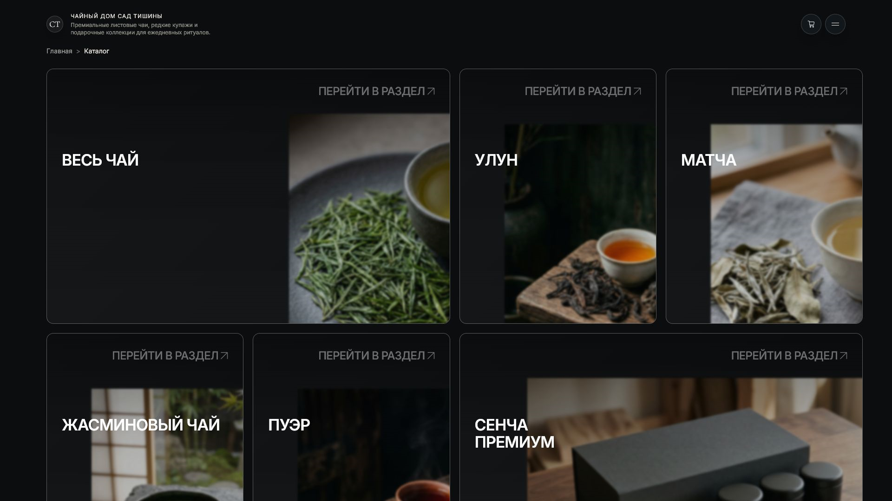

- Маршрут: `/catalog`;
- Быстрый переход к основным категориям чайной коллекции.

### Полный каталог

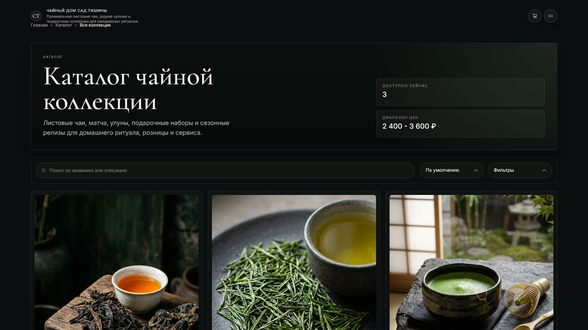

- Маршрут: `/catalog/all`;
- Поиск, сортировка, фильтрация по типу, назначению и стоимости.

### О чайном доме

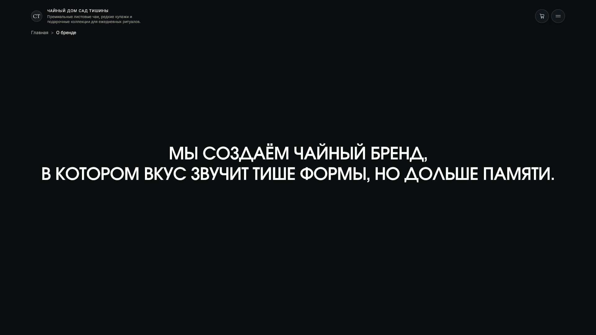

- Маршрут: `/about`;
- История бренда, подход к отбору чая и форматы работы.

### Партнёрам

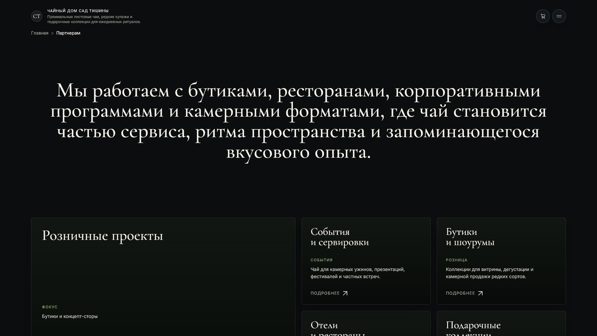

- Маршрут: `/partners`;
- Решения для бутиков, ресторанов, корпоративных заказов и мероприятий.

### Партнёрская программа

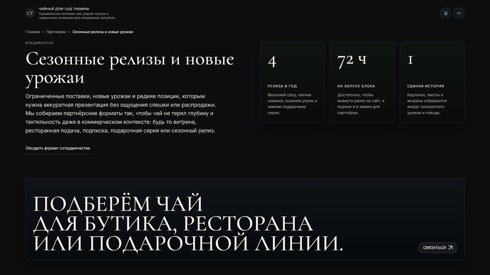

- Маршрут: `/partners/7`;
- Подробное описание выбранного формата сотрудничества и форма заявки.

### Чайный журнал

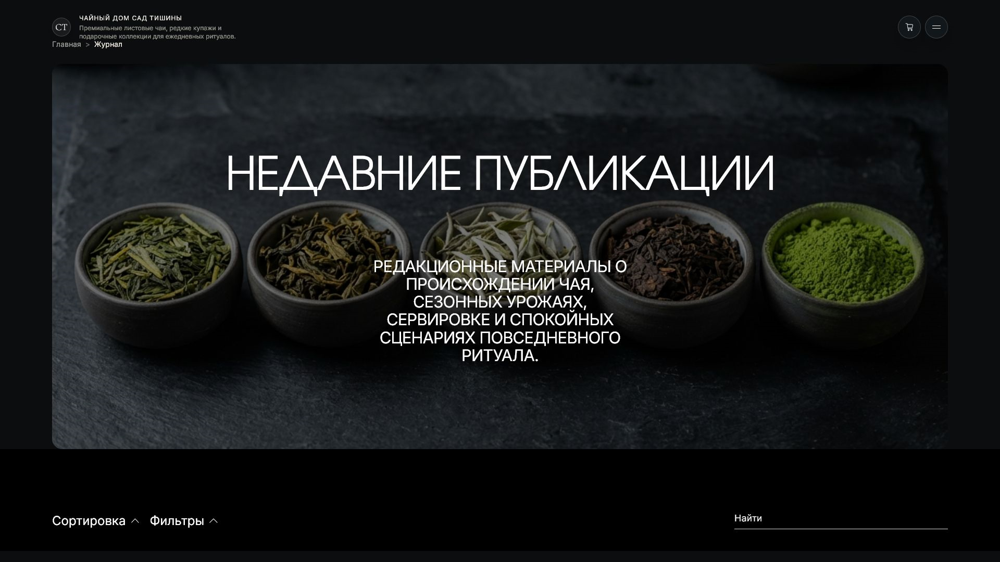

- Маршрут: `/blog`;
- Материалы о сортах, происхождении, заваривании и чайной культуре.

### Статья

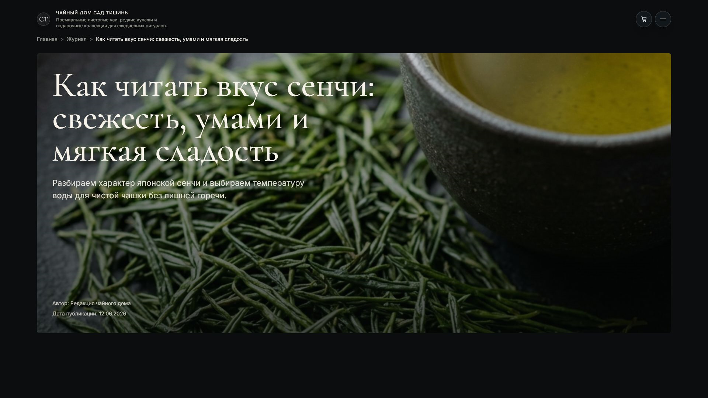

- Маршрут: `/blog/1`;
- Полный материал с разделами, иллюстрациями и связанными публикациями.

### Обработка данных

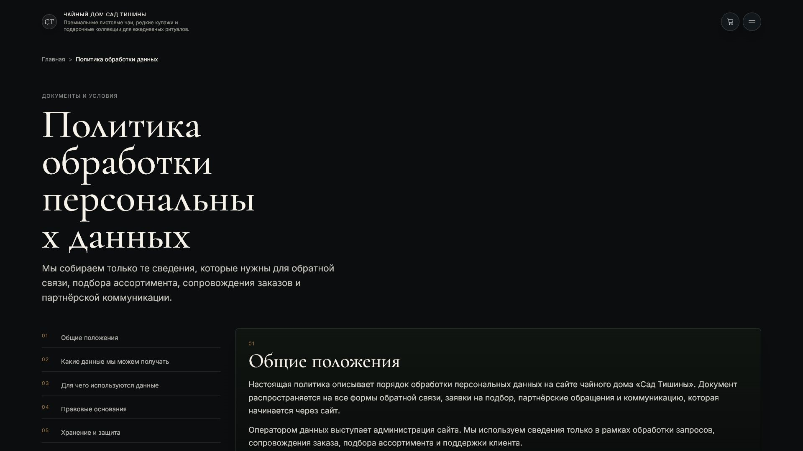

- Маршрут: `/policy-opd`;
- Условия обработки персональных данных с навигацией по разделам.

### Вход в панель управления

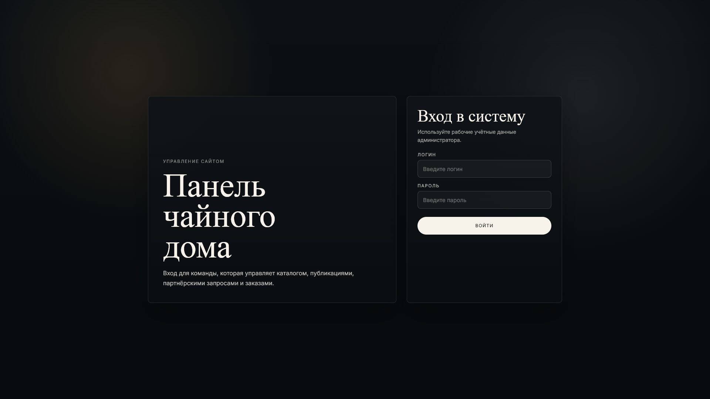

- Маршрут: `/admin/login`;
- Авторизация сотрудников для управления каталогом, заказами и публикациями.

### Вход в панель управления

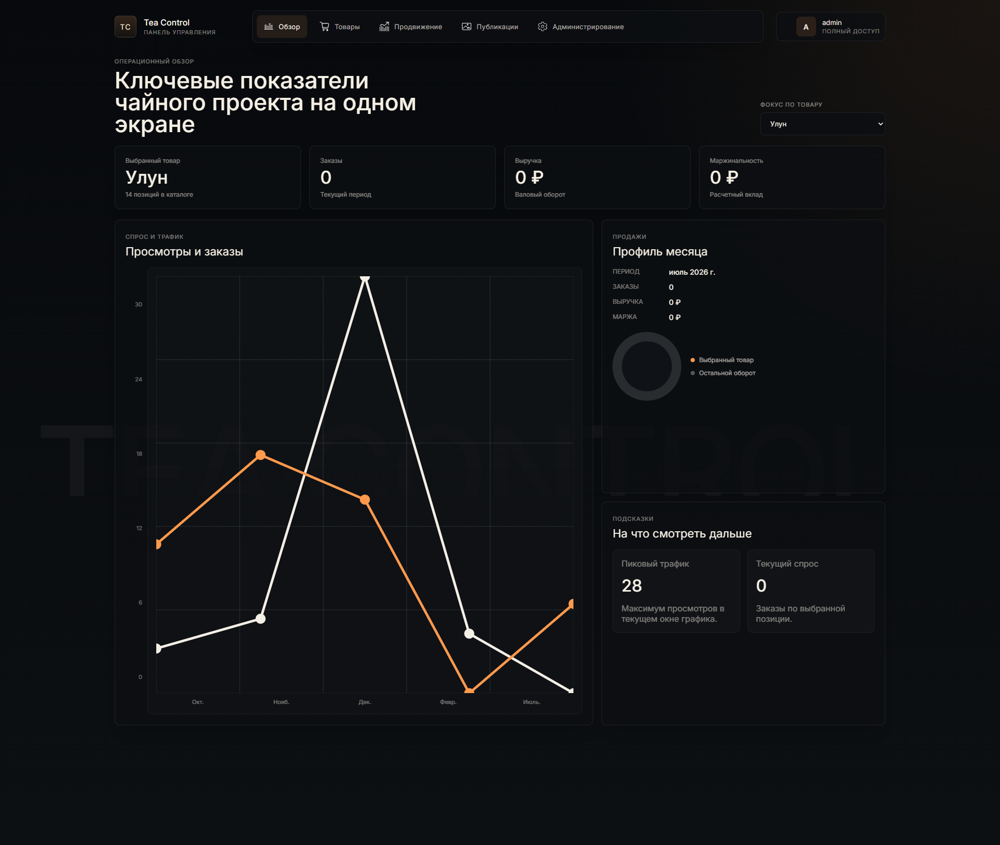

- Маршрут: `/admin/dashboard`;
- Управление каталогом, заказами и публикациями.

## Стек

- React 19 и Vite;
- React Router;
- GSAP, Framer Motion и Three.js;
- Node.js и Express;
- MySQL;
- JWT для авторизации;
- Nodemailer для заявок и заказов.

## Структура

```text
front/        Клиентский сайт
adminPanel/   Панель управления
server/       API и работа с базой данных
3dList/       3D-модели
docs/         Изображения для документации
```

## Запуск

Установить зависимости в каждой части проекта:

```bash
cd server && npm install
cd ../front && npm install
cd ../adminPanel && npm install
```

Запустить API, сайт и панель управления в трёх терминалах:

```bash
cd server
npm start
```

```bash
cd front
npm run dev
```

```bash
cd adminPanel
npm run dev
```

По умолчанию API работает на `http://localhost:3000`. Для MySQL используется база `tea_template` на порту `3307`.

## Сборка

```bash
cd front
npm run build

cd ../adminPanel
npm run build
```

Настройки почты находятся в `server/.env.forms.example`. Перед публикацией необходимо задать собственный `JWT_SECRET` и параметры SMTP.

## Развертывание на Render

В репозитории находится `render.yaml`. Он создает один Web Service, который раздает сайт, панель управления и API.

- Build Command: `npm run render-build`;
- Start Command: `npm start`;
- Health Check Path: `/healthz`;
- Сайт: `/`;
- Панель управления: `/admin/`;
- API: `/api`.

Без внешней MySQL сайт запускается с локальным контентом, а функции админки, требующие базу, недоступны. Для подключения базы необходимо установить `DATABASE_ENABLED=true` и добавить переменные `DB_HOST`, `DB_PORT`, `DB_USER`, `DB_PASSWORD`, `DB_NAME`. Для MySQL с обязательным TLS также задается `DB_SSL=true`.
